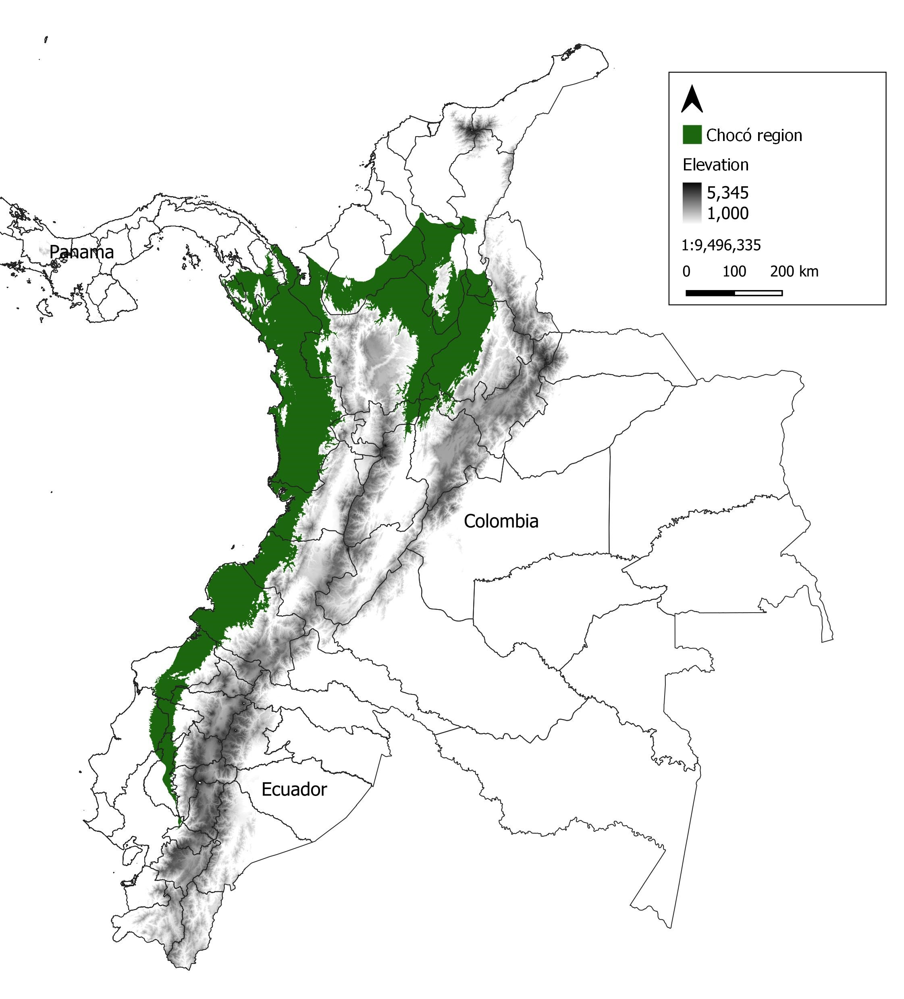
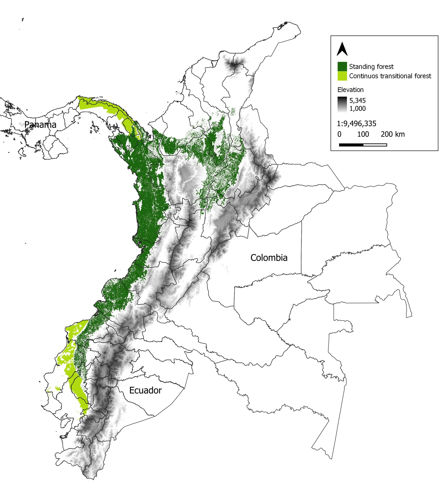

# Ecological_delimitation_of_the_Choco_region
We present a new ecological delimitation of the Chocó region using Holdridge's life zone approach and an altitudinal threshold. All data were extracted from Google Earth Engine. This newly defined area includes a continuous wet unit spanning southern Panama, the Colombian Pacific, the humid system of the Magdalena River in northern Colombia, and the northern Pacific region of Ecuador. Additionally, we present a delimitation that encompasses the current standing forest and the continuous forest surrounding the wet unit.

|  |  |
|:-----------------------------:|:-----------------------------:|
